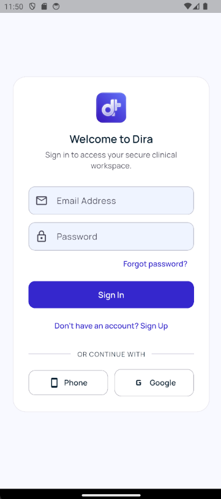
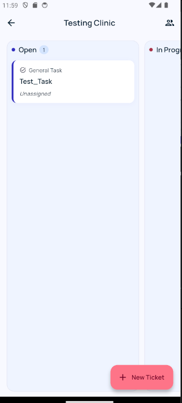
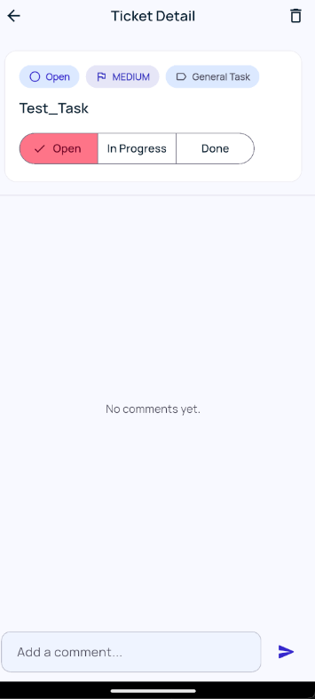
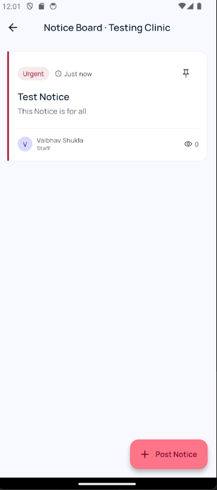
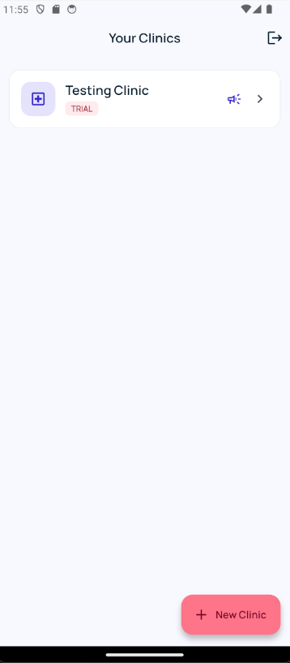
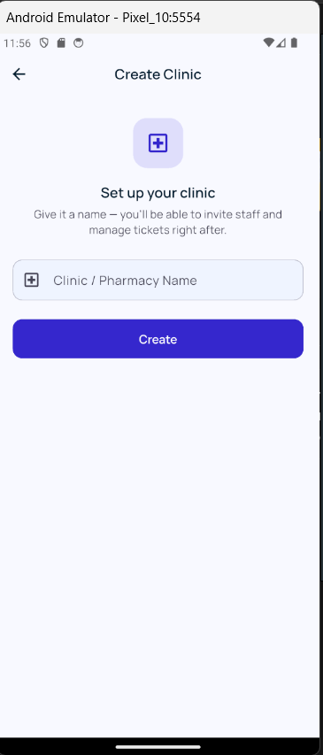
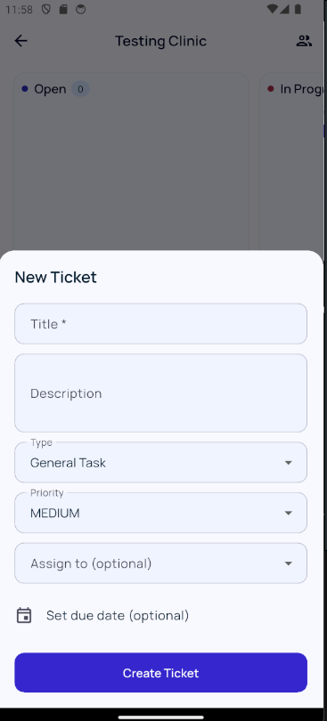
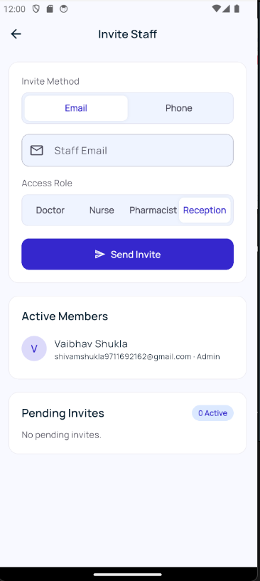

# Dira

**Internal task & ticket coordination for clinics and pharmacies.**

Dira is a multi-tenant SaaS mobile app that gives clinics and pharmacies a shared, real-time workspace for coordinating day-to-day operations — equipment issues, inventory restocking, staff requests, and patient-callback reminders — replacing the WhatsApp groups and sticky notes most small healthcare practices currently rely on.

Built with Flutter and Firebase, deliberately scoped to internal operations rather than patient medical records — keeping it outside HIPAA/health-data territory while solving a real, underserved workflow problem.

<p align="center">
  
  
  
  
</p>

---

## Table of Contents

- [Features](#features)
- [Screenshots](#screenshots)
- [Tech Stack](#tech-stack)
- [Architecture](#architecture)
- [Getting Started](#getting-started)
- [Firestore Security Rules](#firestore-security-rules)
- [Project Structure](#project-structure)
- [Roadmap](#roadmap)
- [License](#license)

---

## Features

| Feature | Description |
|---|---|
| 🏥 **Multi-Tenant Clinics** | Any user can create a clinic and becomes its admin. Staff can belong to multiple clinics, each fully data-isolated at the security-rules layer. |
| 🔐 **Triple Authentication** | Email/Password, Google Sign-In, and Phone/OTP — all independently configured and tested. |
| 📋 **Real-Time Kanban Board** | Drag-and-drop ticket management across Open / In Progress / Done, synced live across every staff member's device. |
| 👥 **Role-Based Access** | Admin, Doctor, Nurse, Pharmacist, and Reception roles with differentiated permissions, enforced in Firestore Security Rules — not just the UI. |
| ✉️ **Automated Invites** | Invite staff by email or phone. Accepted invites auto-grant clinic access on signup, with a branded HTML invite email sent via EmailJS. |
| 💬 **Ticket Comments** | Threaded, real-time comments on every ticket for async team communication. |
| 📌 **Notice Board** | Pinned, clinic-wide announcements with priority flags and view tracking, visible to all staff. |
| 🎨 **Adaptive Theming** | Full light/dark Material 3 theme generated from a custom design-token specification (Indigo/Rose palette, Manrope typeface), following the device's system theme automatically. |

---

## Screenshots

| Login | Your Clinics | Create Clinic | New Ticket |
|---|---|---|---|
|  |  |  |  |

| Kanban Board | Ticket Detail | Invite Staff | Notice Board |
|---|---|---|---|
|  |  |  |  |

---

## Tech Stack

- **Client:** Flutter (Dart) — single codebase, Android-first with iOS/Web scaffolded via FlutterFire
- **Auth:** Firebase Authentication (Email/Password, Google OAuth, Phone/OTP)
- **Database:** Cloud Firestore — real-time listeners throughout, no polling
- **Security:** Custom Firestore Security Rules with reusable `isMember()` / `isAdmin()` rule functions enforcing per-clinic tenant isolation
- **Transactional Email:** [EmailJS](https://www.emailjs.com/) — client-triggered HTML invite emails, no backend server required
- **State Management:** Provider
- **Design System:** Tokenized Material 3 theme (light + dark), single `ThemeData` source of truth
- **Infrastructure:** 100% Firebase Spark (free) tier — zero billing dependency by design

---

## Architecture

Each clinic is a fully isolated tenant. Data model:

```
users/{uid}
  name, email, clinicIds: [clinicId, ...]

clinics/{clinicId}
  name, ownerId, createdAt, plan: 'trial' | 'active' | 'expired'

clinics/{clinicId}/members/{uid}
  role: 'admin' | 'doctor' | 'nurse' | 'pharmacist' | 'reception'

clinics/{clinicId}/invites/{inviteId}
  contact, method: 'email' | 'phone', role, status

clinics/{clinicId}/tickets/{ticketId}
  title, description, type, status, priority,
  assigneeId, assigneeName, createdBy, createdAt, dueDate

clinics/{clinicId}/tickets/{ticketId}/comments/{commentId}
  text, userId, userName, timestamp

clinics/{clinicId}/notices/{noticeId}
  title, body, priority, pinned, postedBy, createdAt
```

Staff at one clinic can never read or write another clinic's data — enforced server-side, not just hidden in the UI.

---

## Getting Started

### Prerequisites

- [Flutter SDK](https://flutter.dev/docs/get-started/install) (^3.7.2)
- A [Firebase](https://console.firebase.google.com/) project (Spark/free plan is sufficient)
- [FlutterFire CLI](https://firebase.flutter.dev/docs/cli/)
- A free [EmailJS](https://www.emailjs.com/) account (for invite emails)

### Setup

```bash
git clone https://github.com/theshuklavaibhav/Dira-Internal-task-ticket-coordination-for-clinics-and-pharmacies.git
cd Dira-Internal-task-ticket-coordination-for-clinics-and-pharmacies
flutter pub get
```

Connect your own Firebase project:

```bash
dart pub global activate flutterfire_cli
flutterfire configure
```

Enable the following in **Firebase Console → Authentication → Sign-in method**:
- Email/Password
- Google
- Phone *(add a test number under "Phone numbers for testing" for free local development)*

Deploy the Firestore security rules:

```bash
firebase deploy --only firestore:rules
```

### Run

```bash
flutter run \
  --dart-define=EMAILJS_SERVICE_ID=your_service_id \
  --dart-define=EMAILJS_TEMPLATE_ID=your_template_id \
  --dart-define=EMAILJS_PUBLIC_KEY=your_public_key
```

> Copy `.vscode/launch.example.json` → `.vscode/launch.json` and fill in your own EmailJS credentials to run directly from VS Code without typing the command above each time.

---

## Firestore Security Rules

Full ruleset lives in [`firestore.rules`](./firestore.rules). Core pattern:

```javascript
function isMember(clinicId) {
  return request.auth != null &&
    exists(/databases/$(database)/documents/clinics/$(clinicId)/members/$(request.auth.uid));
}

function isAdmin(clinicId) {
  return isMember(clinicId) &&
    get(/databases/$(database)/documents/clinics/$(clinicId)/members/$(request.auth.uid)).data.role == 'admin';
}
```

Every collection under a clinic checks membership before allowing reads, and admin-only actions (staff removal, ticket deletion) check the role explicitly.

---

## Project Structure

```
lib/
├── main.dart
├── firebase_options.dart
├── theme/
│   └── app_theme.dart
├── models/
│   └── models.dart
├── services/
│   ├── clinic_service.dart
│   ├── ticket_service.dart
│   └── email_service.dart
├── screens/
│   ├── login_screen.dart
│   ├── phone_login_screen.dart
│   ├── otp_verification_screen.dart
│   ├── clinic_list_screen.dart
│   ├── create_clinic_screen.dart
│   ├── invite_staff_screen.dart
│   ├── kanban_board_screen.dart
│   └── ticket_detail_screen.dart
└── widgets/
    ├── ticket_card.dart
    └── create_ticket_sheet.dart
```

---

## Roadmap

- [ ] Photo/attachment uploads on tickets (Cloudinary)
- [ ] Real push notifications (currently in-app records only)
- [ ] Self-serve billing (Razorpay) — currently manual invoicing
- [ ] SMS delivery for phone-based invites
- [ ] Play Store release build & listing

---

## License

This project is currently unlicensed for public use — all rights reserved. Reach out if you're interested in collaborating or piloting Dira at your clinic.

---

<p align="center">Built with Flutter & Firebase.</p>
